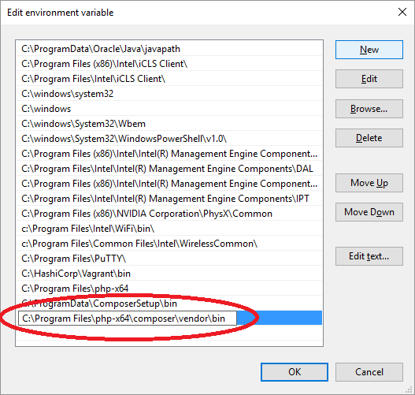

# My Php Coding Standard

## 1. Install

First of all is insert this lines in your `composer.json` placed in your general `Composer` installation folder.

```
{
    "require-dev": {
        "squizlabs/php_codesniffer": "^3.3",
        "fig-r/psr2r-sniffer": "^0.5.0",
        "wp-coding-standards/wpcs": "^1.1",
        "slevomat/coding-standard": "dev-master"
    }
}
```

With this, we will install the Php CodeSniffer and our required libraries.

### Command for terminal

* `phpcs` will check the code using my coding standard and will report all errors and warnings found giving a report
for selected file/folder.
* `phpcbf` will fix automatically all fixable warnings and errors found using my coding standard for selected
file/folder.


### Create command alias

##### Linux
Edit `$HOME/.profile` file and add:
```
## ~/bin/ to be searched after all other directories ##
export PATH=$PATH:$HOME/.composer/vendor/bin/
```

##### Mac
```
ln -s $HOME/.composer/vendor/bin/phpcs /usr/local/bin/phpcs
ln -s $HOME/.composer/vendor/bin/phpcbf /usr/local/bin/phpcbf
```

##### Windows

To make sure your system will be able to find composer installed binaries like `phpcs` we will need to add the global 
vendor directory to the system `PATH` environment variable.

1. Open the system control panel (WINDOWS KEY +PAUSE/BREAK)
2. Select `Advanced system Settings`
3. Select `Environmental variables`
4. Under `System Variables`, select existing `Path` variable
5. Select `Edit`
6. Select `New` and enter C:\Program Files\php-x64\composer\vendor\bin` like shown below: 

    
    
7. Press `Ok` trice to apply the setting.

Make sure to close all open any CMD boxes or they will not be aware of the new environment variable.

### Adding required libraries to our CodeSniffer

We need to set in our CodeSniffer where we have placed the required libraries of our standard.

Located in our root project path:


#### Mac & Linux
```
phpcs --config-set installed_paths $HOME/.composer/vendor/fig-r/psr2r-sniffer/,$HOME/.composer/vendor/wp-coding-standards/wpcs/,$HOME/.composer/vendor/slevomat/coding-standard/
```

#### Windows
```
phpcs --config-set installed_paths C:\Program Files\php-x64\composer\vendor\fig-r\psr2r-sniffer\,C:\Program Files\php-x64\composer\vendor\wp-coding-standards\wpcs\,C:\Program Files\php-x64\composer\vendor\slevomat\coding-standard\
```

Now we are ready to execute our CodeSniffer with our standard and all the code will be checked or fixed when we need it.

We can check all the installed coding standards with this command: 

`phpcs -i`

The result will show:

```
The installed coding standards are PEAR, Zend, PSR2, MySource, Squiz, PSR1, PSR12, PSR2R, WordPress-VIP, WordPress, WordPress-Extra, WordPress-Docs, WordPress-Core and SlevomatCodingStandard
```


### Placing our ruleset
All the rules are inside `ruleset.xml`. You can place it wherever you want. We recommend in a
different project folder, like `/var/www/rulesets`. It's important to remember where you placed it because the path is
needed when we launch the CodeSniffer.

When your file has been placed, you **MUST** update `ruleset.xml` on **line 5**, setting the `vendor` folder path of general `Composer` installation. 


## 2. Launching the CodeSniffer (when the magic happens)

If you want to check the code: 

`phpcs --standard=<ruleset.xml path> <file or path>`

Result example:

------------------------------------------------------------------------------------------

    ------------------------------------------------------------------------------------------
	FOUND 8 ERRORS AND 10 WARNINGS AFFECTING 11 LINES
	------------------------------------------------------------------------------------------
	 24 | WARNING | [ ] error_reporting() can lead to full path disclosure.
	 24 | WARNING | [ ] error_reporting() found. Changing configuration at runtime is rarely
	    |         |     necessary.
	 37 | WARNING | [x] "require_once" is a statement not a function; no parentheses are
	    |         |     required
	 39 | WARNING | [ ] Silencing errors is discouraged
	 39 | WARNING | [ ] Silencing errors is discouraged
	 42 | WARNING | [x] "require_once" is a statement not a function; no parentheses are
	    |         |     required
	 46 | ERROR   | [ ] Inline comments must end in full-stops, exclamation marks, or
	    |         |     question marks
	 46 | ERROR   | [x] There must be no blank line following an inline comment
	 49 | WARNING | [x] "require_once" is a statement not a function; no parentheses are
	    |         |     required
	 54 | WARNING | [x] "require_once" is a statement not a function; no parentheses are
	    |         |     required
	 63 | WARNING | [ ] Detected access of super global var $_SERVER, probably needs manual
	    |         |     inspection.
	 63 | ERROR   | [ ] Detected usage of a non-validated input variable: $_SERVER
	 63 | ERROR   | [ ] Missing wp_unslash() before sanitization.
	 63 | ERROR   | [ ] Detected usage of a non-sanitized input variable: $_SERVER
	 69 | WARNING | [x] "require_once" is a statement not a function; no parentheses are
	    |         |     required
	 74 | ERROR   | [ ] Inline comments must end in full-stops, exclamation marks, or
	    |         |     question marks
	 92 | ERROR   | [ ] All output should be run through an escaping function (see the
	    |         |     Security sections in the WordPress Developer Handbooks), found
	    |         |     '$die'.
	 92 | ERROR   | [ ] All output should be run through an escaping function (see the
	    |         |     Security sections in the WordPress Developer Handbooks), found '__'.
	------------------------------------------------------------------------------------------
	PHPCBF CAN FIX THE 6 MARKED SNIFF VIOLATIONS AUTOMATICALLY
	------------------------------------------------------------------------------------------
	
**Errors or warnings with [x] means that `phpcbf` will be able to automatically fix the problem.

------------------------------------------------------------------------------------------

If you want to fix the code:

`phpcbf --standard=<ruleset.xml path> <file or path>`

Result example:

------------------------------------------------------------------------------------------

    ----------------------------------------------------------------------
    PHPCBF RESULT SUMMARY
    ----------------------------------------------------------------------
    FILE                                                  FIXED  REMAINING
    ----------------------------------------------------------------------
    /Users/unir/Sites/project/dummyClass.php               113    46
    ----------------------------------------------------------------------
    A TOTAL OF 113 ERRORS WERE FIXED IN 1 FILE
    ----------------------------------------------------------------------

    Time: 496ms; Memory: 6Mb

------------------------------------------------------------------------------------------

## 3. Alias for commands 

With those aliases you will use all CodeSniffer utilities quicker.

** **Important** --> You need to update the alias with your `ruleset.xml` path. 

### Check all git uncommitted files
```
alias gcheck "git diff --name-only --diff-filter=AM | xargs phpcs --standard=<ruleset.xml path>"
```

Use: `gcheck`


### Fix all git uncommitted files
```
alias gfix "git diff --name-only --diff-filter=AM | xargs phpcbf --standard=<ruleset.xml path>"
```

Use: `gfix`

### Check file / folder
```
alias ccheck "phpcs --standard=<UNIR-ruleset.xml path>"
```

Use: `ccheck dummyFile.php`

#### Fix file / folder

```
alias cfix "phpcbf --standard=<UNIR-ruleset.xml path>"
```

Use: `cfix dummyFile.php`
